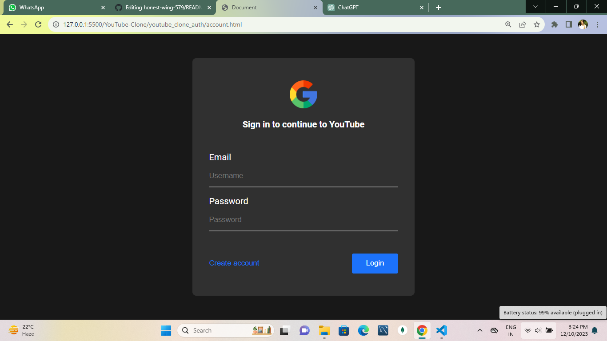

# YouTube-Clone
## Description 

YourTube Clone is an innovative web-based platform meticulously designed to emulate the immersive functionality and visually engaging user interface of the widely acclaimed video-sharing giant, YouTube. This dynamic application is crafted with a robust combination of HTML, CSS, and JavaScript, ensuring a seamless and intuitive experience for users who seek to share and explore an extensive array of multimedia content.

## Key Features
<ol>
<li><b>Video Playback : </b> Seamlessly watch videos with an intuitive player that supports various resolutions. </li>
<li><b>Search Functionality: </b>Easily find videos using the search bar, with results displayed in a user-friendly manner.</li>
<li><b>User Accounts: </b>Create accounts,log in, and enjoy a personalized experience.</li>
<li><b>Video Recommendations: </b>Receive personalized video recommendations based on viewing history and preferences.</li>
<li><b>Subscribe: </b>Subscribe to videos and watch more related contents.</li>
</ol>

## Screenshots
<h3>You tube home screen</h3>

<h3>Log in page</h3>

<h3>Sign in page</h3>

<h3>Search bar recommendations</h3>

## Technologies Used
<ul>
<li>HTML5</li>
<li>CSS</li>
<li>JavaScript</li>
</ul>

### Code Structure
<ul>
<li>/src: Main source code</li>
<li>/styles: Stylesheets</li>
<li>/scripts: JavaScript files</li>
<li>/screenshots: Screenshots for documentation</li>
</ul>

### Author
<ul>
<li>
Heena Parveen
<ul>
<li>Email: parveenheena1962gmail.com</li>
<!-- <li>Twitter: @Heenap25</li> -->
</ul>
</ul>